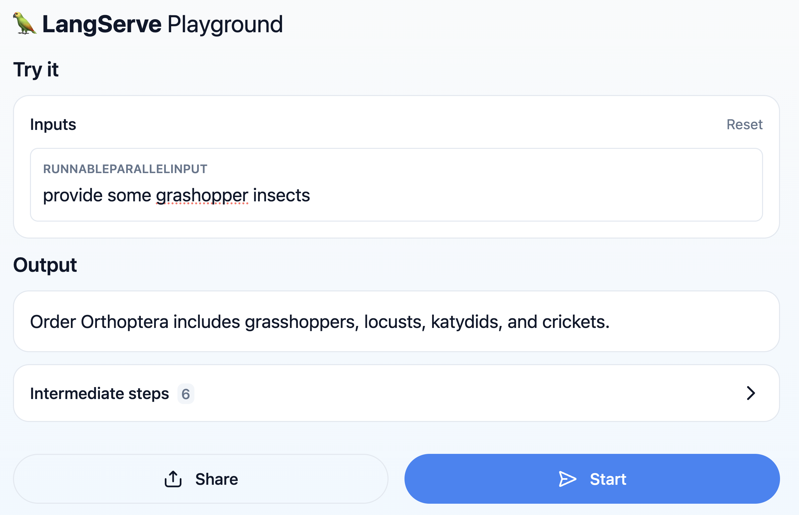

# my-rag

## How to install a template in your own project

1. install the langchain cli 
```commandline
pip install -U langchain-cli types
```
2. create a new langchain project
```commandline
langchain app new my-rag
```
3. cd in my-rag
```commandline
cd my-rag
```
4. add the astra db rag template 
```commandline
langchain app add cassandra-entomology-rag
```
5. make a copy of .env.template to .env and edit the Astra DB credentials
```commandline
cp ./packages/cassandra-entomology-rag/cassandra_entomology_rag/.env.template ./packages/cassandra-entomology-rag/cassandra_entomology_rag/.env
```
6. start langserve on your local machine from the my-rag folder
```commandline
langchain serve
```
7. use browser url to access the playground [http://localhost:8000/cassandra-entomology-rag/playground](http://localhost:8000/cassandra-entomology-rag/playground/)


That's it!

# In case you just want to clone this repo

1. clone this repo
```commandline
git clone https://github.com/difli/my-rag.git
```
2. install the langchain cli
```commandline
pip install -U langchain-cli types
```
3. make a copy of .env.template to .env and edit the Astra DB credentials
```commandline
cp ./packages/cassandra-entomology-rag/cassandra_entomology_rag/.env.template ./packages/cassandra-entomology-rag/cassandra_entomology_rag/.env
```
4. start langserve on your local machine 
```commandline
langchain serve
```
5. use browser url to access the playground [http://localhost:8000/playground/](http://localhost:8000/playground/)

This template will perform RAG using Apache Cassandra® or Astra DB through CQL (`Cassandra` vector store class)